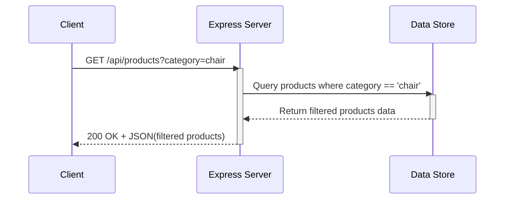

# Weekend Work: Architecting the API

## 1. Contract Table

| Attribute | Details |
| :--- | :--- |
| **Endpoint URL** | `/api/products` |
| **HTTP Method** | `GET` |
| **Description** | Retrieves a list of products. Can be filtered by category. |
| **Query Parameters** | `category` (string, optional) - The category to filter by (e.g., `?category=chair`). |
| **Request Body** | None |
| **Success Response** | **Code:** `200 OK` **Content:** JSON array of product objects. |
| **Error Response** | **Code:** `500 Internal Server Error` **Content:** `{ "error": "Something went wrong" }` |

## 2. Sequence Diagram (Request/Response Map)

## 3. GenAI Prompt

**Prompt:**
> "Please write an `Express.js` GET route for fetching products at the `/api/products` endpoint. The route should accept an optional query parameter for 'category'. If the 'category' query parameter is provided in the request (e.g., `/api/products?category=chair`), it should filter the products array and return only the matching products. If no category is provided, it should return all products. Please ensure your code has comments explaining how it works step-by-step!"
