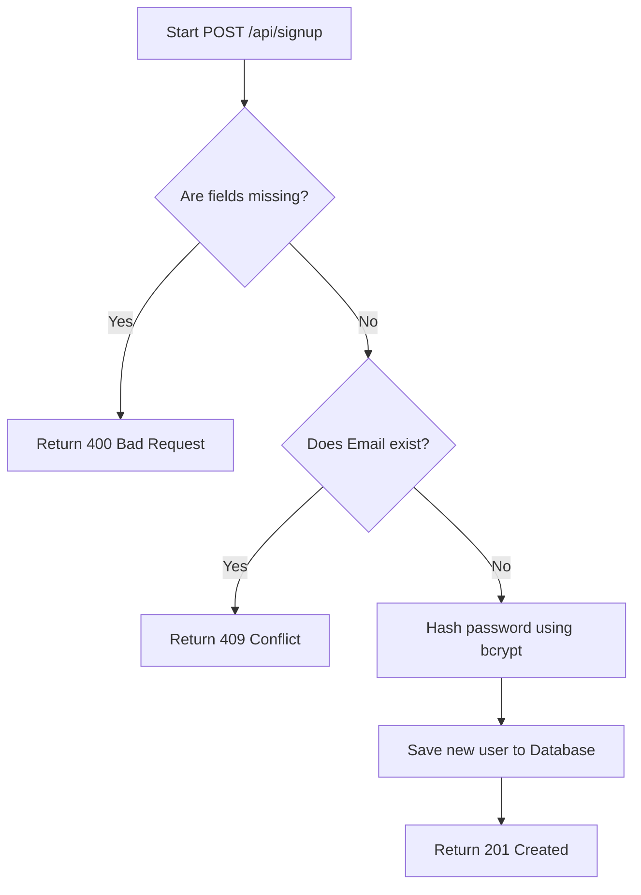
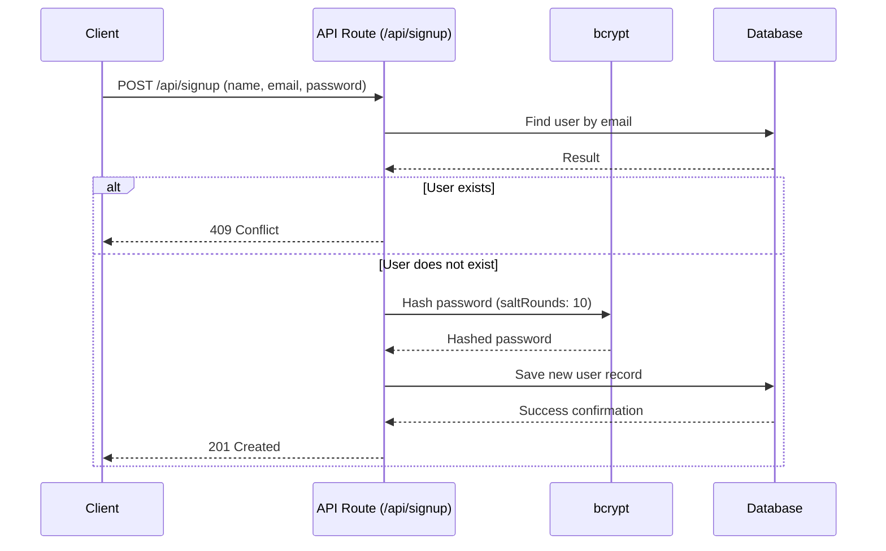

# User Registration Authentication (Tonight's Work)

## 1. Contract Table

| Route | Method | Request Payload | Response (Success) | Response (Error) | Description |
|---|---|---|---|---|---|
| `/api/signup` | `POST` | `name` (string) `email` (string) `password` (string) | **`201 Created`** `{ success: true, message: 'Signup successful' }` | **`400 Bad Request`** `{ success: false, message: 'Please provide all required fields' }`  **`409 Conflict`** `{ success: false, message: 'Email already exists' }` | Registers a new user. Hashes the password using `bcrypt` before storing the user in the database. |

## 2. Activity Diagram

## 3. Sequence Diagram

## 4. GenAI Prompts

**Prompt for `Express.js` route & logic (`register.js`):**

> **Act as an expert backend developer.** Using the Contract Table and Diagrams provided above, please generate an Express.js route inside a separate file named `register.js` for handling the `POST /api/signup` logic. 
>
> The route must:
> 1. Receive `name`, `email`, and `password` from the request body.
> 2. Validate that all fields are present (return `400 Bad Request` if any are missing).
> 3. Check if the email already exists in the database. If it does, return `409 Conflict`.
> 4. If the user does not exist, use the `bcrypt` library to hash the password securely.
> 5. Save the new user record into the database.
> 6. Return `201 Created` upon successful registration.
>
> **CRITICAL INSTRUCTION:** Ensure your code has comprehensive comments explaining how it works step-by-step!
